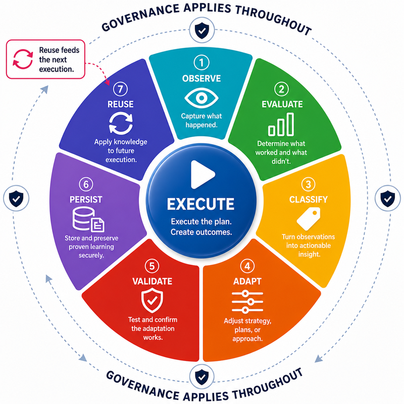

# Infoconex AI Flywheel Lifecycle

The AI Flywheel operates as a recurring eight-stage cycle:

**Execute → Observe → Evaluate → Classify → Adapt → Validate → Persist → Reuse**

The lifecycle turns operating experience into validated learning that can improve or reinforce future execution.

## Before the Cycle: Human Authorization

Before autonomous operation begins, a human or authorized group defines the scope within which the Flywheel may operate.

That authorization is represented through a Governance Policy defining:

- What the AI may do on its own
- What requires approval
- What conditions require human judgment
- When escalation is required
- What actions are prohibited

Human authorization does not require a human to manually start every execution. Once authorized, the Flywheel may operate in response to schedules, events, triggers, requests, or ongoing conditions within the authority it has been given.

See [Principle 1: Autonomy Is Bounded by Human Authority](../principles/01-human-authority.md).

## Governance Applies Throughout the Lifecycle

Governance is not another lifecycle stage. It applies whenever the Flywheel proposes an action, decision, change, or persistent learning.

A governed action or change resolves to one of four outcomes:

1. **Authorized** — The AI may proceed on its own.
2. **Approval Required** — The AI recommends an action but requires human permission.
3. **Judgment Required** — The AI does not have enough evidence to responsibly determine the correct action.
4. **Prohibited** — The action is not allowed under the current Governance Policy.

Where practical, escalation should pause only the affected decision rather than unnecessarily stopping unrelated authorized work.

See [Governance and Escalation](../../architecture/governance-and-escalation.md).

## Lifecycle Stages

1. [Stage 1: Execute](01-execute.md) — Perform the work using procedural guidance, AI reasoning, and deterministic capabilities.
2. [Stage 2: Observe](02-observe.md) — Capture evidence about what actually happened during execution.
3. [Stage 3: Evaluate](03-evaluate.md) — Compare the outcome against the intended result and success criteria.
4. [Stage 4: Classify](04-classify.md) — Identify what was learned, whether adaptation is justified, and where any resulting learning should live.
5. [Stage 5: Adapt](05-adapt.md) — Create a candidate improvement when change is justified or explicitly resolve that no adaptation is required.
6. [Stage 6: Validate](06-validate.md) — Validate a candidate improvement or resolve whether no-change learning intended for persistence is sufficiently supported.
7. [Stage 7: Persist](07-persist.md) — Persist validated learning, reinforce an existing validated operating pattern, or explicitly resolve that no new persistent learning is justified.
8. [Stage 8: Reuse](08-reuse.md) — Use relevant persisted learning and validated operating patterns in later execution.

## Lifecycle Stage Document Structure

Each lifecycle stage follows a consistent document structure.

### Normative Stage Contract

The normative contract for each stage uses the same five sections:

- **Required Inputs and Preconditions** — What must be available or true before the stage can perform its responsibility.
- **Required Responsibilities** — What the stage must accomplish.
- **Required Outputs and Evidence** — What the stage must produce or preserve.
- **Completion Conditions** — What must be true for the stage responsibility to be considered complete.
- **Relationship to Adjacent Stages** — How the stage consumes the prior stage's output and prepares the next stage's input.

The stage contracts define required lifecycle responsibilities without prescribing a specific agent framework, programming language, storage mechanism, AI platform, or execution architecture.

Completion conditions define the boundary of each stage responsibility. Retry behavior, backward transitions, escalation paths, stopping conditions, validation-failure routing, and other lifecycle transition semantics are defined by the transition rules below rather than by a requirement that every implementation execute the stages as a rigid linear workflow.

### Supporting Sections

Each lifecycle stage also includes supporting sections that explain and connect the contract:

- **Purpose** — Why the stage exists.
- **Governance Considerations** — How authority, approval, prohibition, and human judgment affect the stage.
- **Relationships to Principles** — Which named principles are most directly connected to the stage.
- **Stage Navigation** — Where the stage sits in the lifecycle.
- **Related Documents** — Where to find relevant supporting material.

The requirement language defined in the [Specification Overview](../README.md#requirement-language) applies throughout every lifecycle page. Supporting explanation does not create additional requirements unless it uses requirement language to do so.

## Lifecycle Transition Semantics

The canonical stage order defines the logical responsibilities of the operating model. It does not require every implementation to invoke each stage exactly once or to implement the lifecycle as a rigid linear state machine.

An implementation may use a pipeline, state machine, agent workflow, event-driven process, nested loops, or another architecture. Non-linear control flow does not permit required lifecycle responsibilities to be silently bypassed.

A lifecycle cycle is complete only when the responsibilities required for its outcome have been explicitly resolved. Work that is paused, blocked, stopped, or abandoned must not be represented as a completed cycle merely because execution ended.

### Permitted Transition Behavior

The lifecycle permits the following transition behavior when supported by evidence and governance:

- **Forward transition** — Continue to the next logical responsibility when the current stage has a supported result.
- **Retry** — Repeat a stage or operational attempt when another attempt is justified.
- **Backward transition** — Return to an earlier stage when new evidence changes or invalidates an earlier assumption, assessment, classification, or candidate.
- **Escalation or pause** — Pause the affected decision for required approval or human judgment and resume from the stage appropriate to the resulting decision.
- **Stop or abandon** — End an attempted action or candidate when proceeding is unsafe, prohibited, unsupported, or no longer justified.

Retries and backward transitions must preserve material evidence from earlier attempts. A later success does not erase a prior failure when that failure remains relevant to evaluation or learning.

Stopping an action or candidate does not convert an incomplete outcome into a successful one, and it does not require useful evidence to be discarded. When stopped or failed work produces a meaningful new learning opportunity, that evidence enters the lifecycle through the appropriate evaluation and classification responsibilities before any resulting learning can be persisted or reused.

### Successful No-Change Behavior

The lifecycle exists to improve future execution when evidence justifies improvement. It does not require change for its own sake.

When evaluation shows a successful or acceptable outcome and classification determines that no adaptation is warranted:

1. **Classify** records the no-change disposition and whether the outcome reinforces an existing validated operating pattern.
2. **Adapt** explicitly resolves that no candidate adaptation is required rather than manufacturing an unnecessary change.
3. **Validate** records that no candidate change requires validation and determines whether any reinforcing or reusable learning intended for persistence is sufficiently supported.
4. **Persist** tracks sufficiently supported reinforcing evidence with the existing validated pattern, or explicitly resolves that no new persistent learning is justified.
5. **Reuse** continues to make the validated operating pattern and relevant accumulated learning available to later execution.

A deliberate `no adaptation required` outcome therefore resolves the later lifecycle responsibilities without pretending that an adaptation occurred and without silently skipping those responsibilities.

Repeated successful outcomes can strengthen the evidence supporting an existing validated pattern. That reinforcing evidence is learning even when the operating behavior itself remains unchanged.

### Failure and Validation-Failure Behavior

A failed execution, failed adaptation, or failed validation can produce valuable evidence and reusable learning.

The lifecycle must distinguish between the status of an attempted adaptation and the status of the learning produced by that attempt:

- A failed, unresolved, or unvalidated adaptation must not be promoted as an approved operational improvement.
- The evidence produced by the failed attempt remains available for evaluation and classification.
- A reusable lesson derived from failure may become a different persistent asset, such as a known-failure rule, applicability constraint, detection rule, validation check, procedural instruction, or strategy-selection rule.
- Failure-derived learning must follow the lifecycle in its own right: it is evaluated, classified, represented through the appropriate adaptation destination when required, validated, persisted, and reused.
- Preserving a historical record of failure does not by itself make the failure operational learning. The resulting lesson must become available to future operation in an appropriate persistent form.

This prevents a failed candidate from being smuggled into future behavior while still allowing the Flywheel to learn from why the candidate failed.

### Validation Failure Does Not End Learning

When validation fails or remains unresolved, the candidate is not eligible to become an approved operational improvement. The validation result becomes new lifecycle evidence and may lead to:

- Retrying validation when the validation activity itself was incomplete or inconclusive.
- Returning to Adapt to revise or replace the candidate when the classification remains sound.
- Returning to Classify when the failure shows that the learning was routed to the wrong destination.
- Returning to Evaluate when the intended outcome, evidence, or earlier assessment must be reconsidered.
- Escalating for human judgment or authorization.
- Stopping the attempted improvement while preserving evidence that may reveal a separate learning opportunity.

Any separate learning derived from the failed candidate must still be evaluated and classified before the system decides where that learning should persist.

## The Flywheel Effect

The cycle becomes a Flywheel when later execution uses the learning created or reinforced by earlier lifecycle operation.

The goal is not change for its own sake. Stable successful behavior should remain stable. The system should evolve when evidence shows that a lasting improvement is justified, learn from failed attempts without promoting failed changes, and retain evidence that strengthens confidence in patterns that continue to work.

A mature AI Flywheel should reduce repeated reasoning, repeated failure, and unnecessary human intervention while preserving AI judgment and human authority where they are still needed.

## Related Documents

- [Formal Definition](../definition.md)
- [Terminology](../terminology.md)
- [Principles](../principles/README.md)
- [Conformance](../conformance/README.md)
- [Core Operating Model](../../architecture/operating-model.md)
- [Worked Example: Continuous Dependency Maintenance](../../examples/software-maintenance/worked-example.md)
